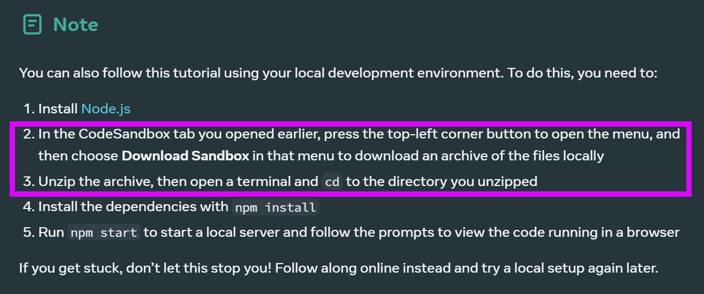
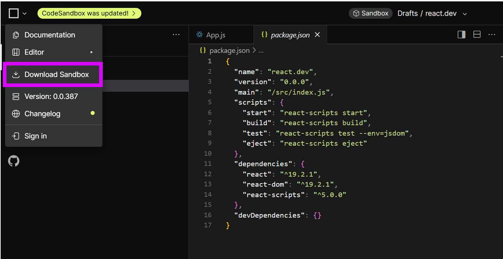
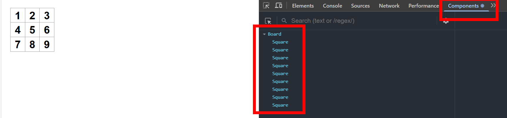

# ReactTraining1TicTacToe - Setup

Starting with the instructions found here:

https://react.dev/learn/tutorial-tic-tac-toe

## Installing Node

```node-v24.12.0-x64.msi```

## Downloading files from CodeSandbox didn't work?

Following these instructions:





Downloaded a zip file in this format with a GUID filename; but the zip file downloaded was empty.

```2aea0ee8-3ce7-457b-b2ab-118ed8059c8f.zip```

The file structure and file content was visible in CodeSandbox so it was possible to just create the required files and copy and paste their content. 

Perhaps CodeSandbox expects you to log in before you can download the files?

## npm install

Creating the required files in this repo (literally copy-and-pasting out of CodeSandbox) manually enabled ```npm install``` to be run.

## npm start

```npm start``` launched the same application as had been seen in the "Preview" in CodeSandbox, but running locally.

## Git Ignore

Including ```node_modules/``` didn't seem correct so a git ignore file was added, the second file because I'm editing in VS2026.

- https://github.com/github/gitignore/blob/main/Node.gitignore
- https://github.com/github/gitignore/blob/main/VisualStudio.gitignore

## React Dev Tools for Chrome

Viewing the F12 console prompts you to install a browser extension, adding the "Components" and "Profiler" tabs to Chrome.

https://react.dev/learn/react-developer-tools



*This appears to be built into CodeSandbox but I'm not using that.*

---

# TODO

- Add lint
- Fix issues highlighted by SonarQube
- Add a facility to clear the board and start a new game
- How do we unit test this?
- How do we break the content of App.js into multiple files?
